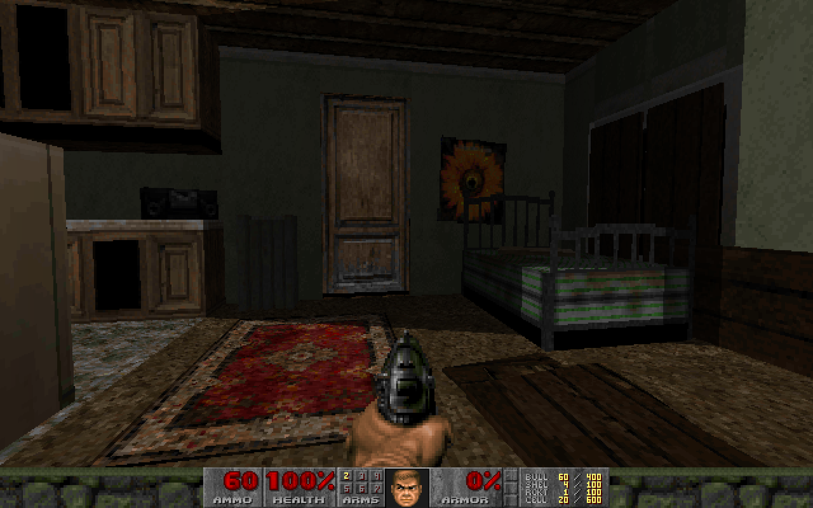
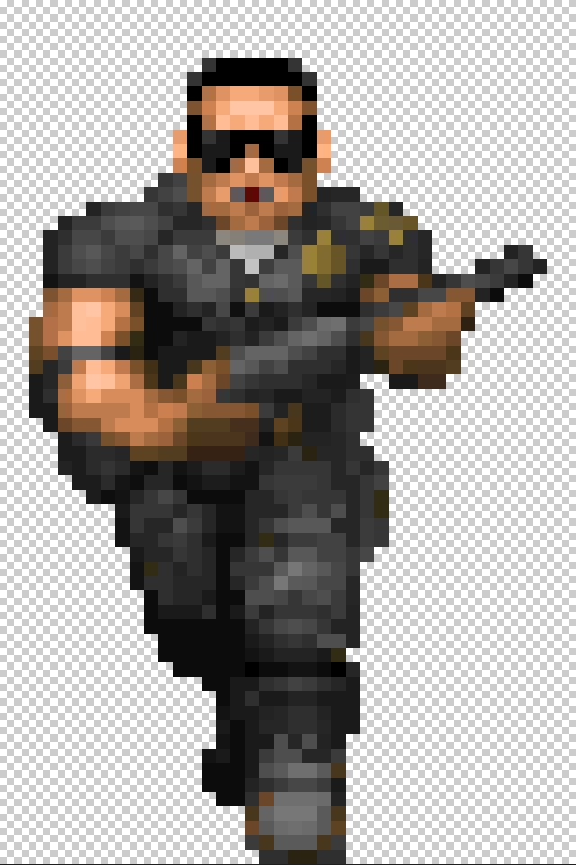
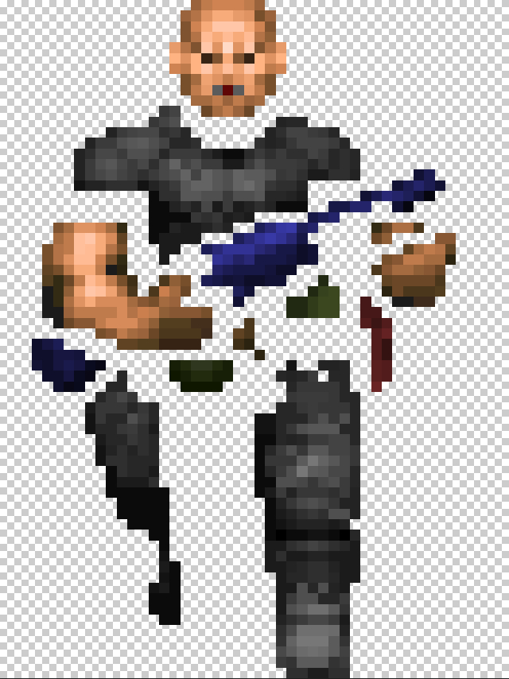
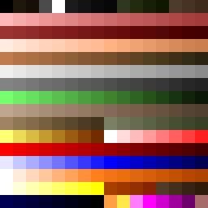
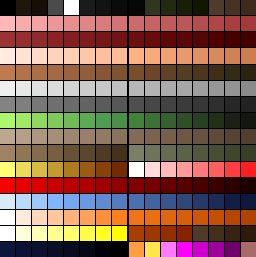
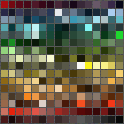
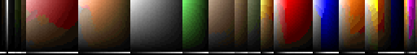

# [Bloodlines TC](README.md)

VtM Bloodlines in Doom

## Proof of concept

https://github.com/nrkn/sm-vtmb-wad



## Current Status

We are in the **Research** stage

## Goal

At it's most basic:

1. **Very Short Term Plan** - you can run around outside Santa Monica
2. **Short Term Plan** - you can run around outside all the hubs
3. **Mid Term Plan** - you can go inside selected places
4. **Long Term Plan** - there are things to do

For the **Long Term Plan**, I think it's best to leave it open for now. There are lots of ways you could do this, with the two extremes
perhaps being:

1. you're Doomguy, in the VtMB universe for some reason, and you're playing Doom 
2. it's bloodlines made in an alternate universe where for some reason the team only had the Doom engine to work with

There is also a lot of midground - you could have it mostly doom, but model the keycard/switch puzzles off real VtMB quests

### Music

A placeholder at least - even if just something that fits aesthetically (todo find and add link to reddit comment with youtube links)

Not really my wheelhouse - but we need the music as midi files 

### Monster Sprites

Ideally several different NPCs

At least a generic NPC and/or a cop as decoration while you run around



Due to the limitations of details being readable at this scale, I would prefer to modify the DOOM sprites, or at least keep NPCs drawn as sprites, rather than eg rasterize Bloodlines models (though I could be open to this if we could automate it **and** it looks good)

If going down sprite path, I have some existing partial code somewhere for doing paper doll stuff, so we could create a handful of body types based on the generic doom human sprite and then dress them up



What other sprites are needed depends on what happens with the **Long Term Plan**

### Sound

Not my wheelhouse but sure it can be sorted out

I would like deb of night when you interact with a radio tho

### TC boilerplate

Replacing eg font, title screen, endoom etc 

## Plan

1. **[Research](research/readme.md)** - what needs to be figured out - what can be automated - what tools do we need to find/make?
2. **Survey** - comprehensive screen shots from Bloodlines for comparison while building
3. **Gather** - from Bloodlines, export and convert geometry, find and extract used textures using bill of materials from bloodlines map 
4. **Build** - turning converted geometry blueprint into actual doom level, test and find right scale, fixing, tweaking etc
5. **Art** - using scale, create various patches, textures, sprites etc from exported materials, tweak for doom palette
5. **Decorate** - texture level, lighting, objects (mix of sprites and doom "geometry" eg raised floor for table) etc
6. **NPCs** - can we script them to roam and be non hostile unless player fires a weapon?

## Contributing

At this stage, read this document and let me know your thoughts and what you're interested in doing

## Tools

### Bloodlines

- Bloodlines SDK - comes with the Plus Patch
  - Hammer Map Editor
  - Texture Utils

Hammer can export to DXF, an Autocad format - it's pretty crude, just exports a raw list of polyfaces, no info about textures

~~Research: is there a way to get a bill of materials for a level out of Hammer?~~ 
[Bill of materials for Pawnshop Apartments](research/geometry/webman-VMFParser/results/sm_pawnshop_1_d.vmf_materials.txt)

*Research*: can any newer versions of Hammer still open Bloodlines maps? If so might be able to export something better - alternately see 
if there is a parser that can load Valve VMF maps, like https://github.com/webman/vmf-parser, but because the Bloodlines version is so old
this might be a stretch

**Update**: VMFParser can get bill of materials

**Update**: [The level VMF is a text format](research/geometry/webman-VMFParser/sources/sm_pawnshop_1_d.vmf) - 
we can parse it ourselves if necessary

### Doom

- Ultimate Doom Builder 3.0.0.3925 (2dfe043)
- Slade 3.1.13

Doom Builder supports UDMF, a text format - it's easy to work with if you want to eg generate/import geometry from code

Slade is a lump editor, so we can merge together UDMF text maps, custom graphics, music etc into a WAD that a source port can play

## Level geometry

Doom requirements are that any sectors have to have a single floor and ceiling, eg no level over level

Based on some prior work I've done and a bit of research, I think the basic process to convert from the DXF that Hammer exports 
is that you map the 3D polyfaces to 2 sets of 2d polygons - looking from top down, the ceiling, looking from bottom up, the floor

Then take the 2d polygon sets, and create vertices, linedefs, sidedefs and sectors for doom and save to UDMF

I have code that can so far convert the DXF as far as UDMF vertices and linedefs - I think building sidedefs and sectors is 
relatively straightforward but might involve a bit of swearing

We have no texture information in the DXF but we have a unique ID for each polyface - so each wall should have a generated 
custom texture with it's polyface ID on it:

```
+------+
|      |
| 3102 |
|      |
+------+
```

Then we can use the *Survey* data to figure out the texture for each numbered polyface - bit manual but easiest option if 
we can't get any more useful info out of Hammer.

I suspect (haven't been able to verify yet) that in some cases - for example if a building has a basement and something weird above it, or where buildings have overhangs - that this technique is going to create an empty open space in the doom map where something should be - but the outlines for it will be visible as double sided linedefs on the map, so shouldn't be too hard to fix manually 

## Level texturing

All the required textures are included with VtMB and the tools to convert them to eg PNG are included with the SDK

### Palette

The Doom palette doesn't do a terrible job - noticably absent though are the neon cyans that are really prevalent in Bloodlines



There is an [alternate Doom palette](https://www.doomworld.com/forum/topic/109994-coldpal-a-new-palette-for-doomdoom2-on-idgames/) which is a drop in replacement that has improved blues



Another option is to use a custom palette. I had a quick play with sampling a palette from some Bloodlines screenshots. It had a **lot** of yellow and cyan. 



You can then build a new palette based on the sample - this is a bit of work because unless you organise the custom palette into roughly the same ramps as are used in the Doom palette, you also have to create a custom COLORMAP lump (a lookup table that Doom uses for lighting, it has indices into the palette).



I'm leaning heavily towards just using the improved blue palette, saves work, though a custom palette would be fun to make

However you manage the palette, all textures, sprites etc have to be converted to this palette 

If you do it automatically, some will look great but most will come out entirely/mostly grayscale - the absolute best way is to convert them one at a time manually (eg adjusting hues, contrast, saturation, brightness - in many cases to only part of the texture - before applying palette), but it's time consuming

I have some ideas for tools to help speed this up

## Level decoration

todo

## Hub traversal

todo

## Things I forgot to cover

todo

## License

This is free and unencumbered software released into the public domain.

Anyone is free to copy, modify, publish, use, compile, sell, or
distribute this software, either in source code form or as a compiled
binary, for any purpose, commercial or non-commercial, and by any
means.

In jurisdictions that recognize copyright laws, the author or authors
of this software dedicate any and all copyright interest in the
software to the public domain. We make this dedication for the benefit
of the public at large and to the detriment of our heirs and
successors. We intend this dedication to be an overt act of
relinquishment in perpetuity of all present and future rights to this
software under copyright law.

THE SOFTWARE IS PROVIDED "AS IS", WITHOUT WARRANTY OF ANY KIND,
EXPRESS OR IMPLIED, INCLUDING BUT NOT LIMITED TO THE WARRANTIES OF
MERCHANTABILITY, FITNESS FOR A PARTICULAR PURPOSE AND NONINFRINGEMENT.
IN NO EVENT SHALL THE AUTHORS BE LIABLE FOR ANY CLAIM, DAMAGES OR
OTHER LIABILITY, WHETHER IN AN ACTION OF CONTRACT, TORT OR OTHERWISE,
ARISING FROM, OUT OF OR IN CONNECTION WITH THE SOFTWARE OR THE USE OR
OTHER DEALINGS IN THE SOFTWARE.

For more information, please refer to <https://unlicense.org>
